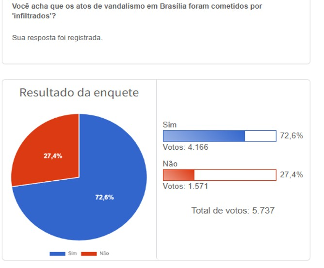

## Roteiro da Aula

1. **Por que amostrar?** — O problema e a solução
2. **Amostra aleatória vs. de conveniência** — Qualidade importa mais que quantidade
3. **A lógica da inferência** — Como a amostra nos diz algo sobre a população
4. **Tipos de amostragem probabilística** — Ferramentas para pesquisa
5. **Atividade prática** — Desenhando sua própria pesquisa

## Introdução: Por que Amostrar?

- Em Ciência Política, raramente temos acesso a toda a **População** (ex: todos os eleitores de um país).
- O **Censo** é caro e demorado (ex: Censo do IBGE).
- Solução: **Amostragem**.
- Objetivo: Fazer uma **Inferência Estatística** (aprender sobre a população a partir de um subconjunto).

> "O processo de utilizar o que sabemos ser verdade sobre uma amostra para inferir o que é provável que seja verdade sobre a população." (Kellstedt & Whitten, p. 152)

## Conceitos Fundamentais

- **População:** O conjunto completo de casos sobre os quais queremos tirar conclusões (ex: todos os eleitores brasileiros em 2026).
- **Amostra:** Um subconjunto da população, selecionado para estudo (ex: 2.000 eleitores entrevistados pelo Datafolha).
- **Parâmetro:** O valor real na população (ex: a proporção de eleitores que aprova o governo). Geralmente **desconhecido**.
- **Estimativa:** O valor calculado a partir da amostra, usado para aproximar o parâmetro (ex: 45% dos entrevistados aprovam).
- **Sampling frame (quadro amostral):** A lista a partir da qual a amostra é sorteada (ex: cadastro eleitoral do TSE, lista de setores censitários do IBGE). Se o quadro amostral não cobre a população, a amostra já nasce enviesada.

## Distribuição Amostral

- Se pudéssemos repetir a mesma pesquisa muitas vezes (mesma população, mesmo tamanho de amostra, mas sorteando pessoas diferentes), cada amostra daria uma estimativa ligeiramente diferente.
- O conjunto dessas estimativas forma a **distribuição amostral**: a distribuição de todos os valores possíveis de uma estimativa.
- A distribuição amostral não é a distribuição dos dados na população — é a distribuição das **estimativas** que obteríamos ao repetir o processo de amostragem.
- Exemplo: se a intenção de voto real é 45%, uma pesquisa pode encontrar 43%, outra 47%, outra 44,5%. A distribuição desses resultados é a distribuição amostral.

## Lei dos Grandes Números (LGN)

- A LGN diz algo simples: conforme o tamanho da amostra cresce, a média amostral se aproxima da média da população.
- Com $n = 10$, a média amostral pode estar longe do parâmetro. Com $n = 10.000$, estará muito perto.
- Formalmente: $\bar{X}_n \xrightarrow{P} \mu$ quando $n \to \infty$
- A LGN **só vale para amostras aleatórias**. Uma amostra de conveniência não converge para o parâmetro verdadeiro, não importa o tamanho.

> **LGN vs. TCL:** A LGN diz que a média amostral *converge* para o valor verdadeiro. O TCL diz qual *forma* a distribuição amostral assume (normal). São complementares.

## O Teorema Central do Limite

- **Teorema Central do Limite (TCL):** A distribuição amostral da média se aproxima de uma curva normal (em forma de sino), independentemente da distribuição original na população.
- Isso vale desde que a amostra seja grande o suficiente (em geral, $n \geq 30$ é uma referência comum).
- É o TCL que permite usar a estatística para fazer inferências: como sabemos a forma da distribuição amostral, podemos calcular a probabilidade de estar longe do valor real.

> **Nota:** O nome vem do alemão *zentraler Grenzwertsatz*, cunhado por George Pólya em 1920. "Zentral" qualifica o teorema, não o limite — é o teorema *central* (o mais importante) sobre limites. Por isso "Teorema Central do Limite", não "Teorema do Limite Central".

## Atividade no R: Vendo o TCL Funcionar

Execute o código abaixo no R. Ele simula uma "população" de renda (distribuição assimétrica) e sorteia muitas amostras para mostrar que a média amostral vira normal.

```{r, eval=FALSE}
set.seed(42)

# Nossa "população": renda mensal de 100.000 pessoas (distribuição assimétrica)
populacao <- rgamma(100000, shape = 2, rate = 1) * 1500

# Visualizar a população (não é normal!)
hist(populacao, breaks = 50, main = "Distribuição da Renda na População",
     xlab = "Renda (R$)", col = "lightblue")

# Parâmetro verdadeiro (média da população)
mean(populacao)
```

---

## Atividade no R: Simulando a Distribuição Amostral

```{r, eval=FALSE}
# Sortear 1.000 amostras e guardar a média de cada uma
n <- 30  # <-- MUDE AQUI: tente 5, 30, 100 e 500
medias <- replicate(1000, mean(sample(populacao, size = n)))

# Distribuição amostral das médias
hist(medias, breaks = 40, main = paste("Distribuição Amostral (n =", n, ")"),
     xlab = "Média amostral", col = "salmon", freq = FALSE)
curve(dnorm(x, mean = mean(medias), sd = sd(medias)),
      add = TRUE, col = "darkred", lwd = 2)
```

**Tarefa:** Rode o código com `n = 5`, depois `n = 30`, `n = 100` e `n = 500`.

- O que acontece com a **forma** do histograma conforme $n$ aumenta?
- O que acontece com a **largura** (dispersão) do histograma?
- A média das médias amostrais se aproxima do parâmetro verdadeiro?

## Erro-Padrão: Medindo a Incerteza

- Cada amostra produz uma estimativa diferente. Essa variação é o **erro-padrão**.
- Erro-padrão = desvio-padrão da distribuição das médias amostrais.
- **Amostras maiores → erro-padrão menor → estimativas mais precisas.**
- Mas atenção: isso só funciona se a amostra for aleatória.

## Intervalo de Confiança

- Como não sabemos o valor real da população, construímos um **intervalo** em torno da nossa estimativa.
- Um **intervalo de confiança de 95%** significa: se repetíssemos a pesquisa muitas vezes, 95% dos intervalos conteriam o valor verdadeiro.

$$ \bar{Y} \pm 1{,}96 \times \sigma_{\bar{Y}} $$

- $\bar{Y}$: média amostral (nossa estimativa)
- $\sigma_{\bar{Y}}$: erro-padrão da média
- $1{,}96$: valor crítico para 95% de confiança

## Tamanho da Amostra Importa?

- Amostras maiores reduzem o erro-padrão e aumentam a precisão.
- **Porém:** Uma amostra enorme de conveniência (ex: 1 milhão de votos numa enquete de YouTube) ainda é pior do que uma amostra aleatória pequena (ex: 1.000 pessoas) para representar a população.
- Qualidade (aleatoriedade) > Quantidade.

## Calculando o Tamanho da Amostra

Para estimar uma **proporção** (ex: intenção de voto) com margem de erro $e$ e confiança de 95%:

$$ n = \frac{1{,}96^2 \times p(1-p)}{e^2} $$

- $p$: proporção esperada (use $0{,}5$ se não souber — é o cenário de maior incerteza)
- $e$: margem de erro desejada

**Exemplo:** Margem de erro de 2 pontos percentuais ($e = 0{,}02$), sem palpite sobre $p$:

$$ n = \frac{1{,}96^2 \times 0{,}5 \times 0{,}5}{0{,}02^2} = \frac{0{,}9604}{0{,}0004} = 2.401 $$

É por isso que pesquisas eleitorais usam ~2.000 a 2.500 entrevistas. O tamanho da amostra depende da **precisão desejada**, não do tamanho da população.

## Amostra Aleatória vs. de Conveniência

### Amostra Aleatória (Probabilística)
- Cada membro da população tem a **mesma probabilidade** de ser selecionado.
- É a base para inferências não enviesadas.
- Permite calcular o erro-padrão.

### Amostra de Conveniência (Não-probabilística)
- Casos selecionados por facilidade de acesso.
- **Perigo:** Viés de seleção. A amostra não representa a população.
- Exemplo: Enquetes em redes sociais.

## Exemplo 1: O Viés das "Enquetes" de Redes Sociais

As enquetes no Twitter ou WhatsApp são amostras de conveniência puras.

<div class="columns-2">
{width=30%}

- **Público:** Seguidores de um nicho específico.
- **Auto-seleção:** Apenas os mais engajados respondem.
- **Resultado:** Reflete a opinião do grupo, não do eleitorado geral.
- O uso de enquetes de redes sociais por figuras políticas para validar teses ignora a **validade externa**.
- Uma amostra de seguidores não pode ser generalizada para a "vontade do povo".
</div>

---

## Exemplo 2: Tamanho da população e amostragem

<div class="columns-2">
{width=50%}
</div>

---

## Exemplo 3: Comparação dos tamanhos

<div class="columns-2">
{width=90%}
</div>

---

## Atividade no R: Amostra Aleatória vs. de Conveniência

A população abaixo simula 100.000 pessoas com renda e acesso à internet. Pessoas com mais renda têm mais chance de estar online.

```{r, eval=FALSE}
set.seed(42)

# População: renda e acesso à internet (correlacionados)
renda <- rgamma(100000, shape = 2, rate = 1) * 1500
prob_internet <- pmin(renda / max(renda) + 0.2, 1)
tem_internet <- rbinom(100000, 1, prob_internet)

# Parâmetro verdadeiro
cat("Renda média da população:", round(mean(renda)), "\n")
cat("Renda média de quem tem internet:", round(mean(renda[tem_internet == 1])), "\n")
```

---

## Atividade no R: Comparando as Distribuições Amostrais

```{r, eval=FALSE}
# Simular 1.000 pesquisas de cada tipo
n <- 200  # <-- MUDE AQUI: tente 50, 200 e 1000
medias_aleatoria <- replicate(1000, mean(sample(renda, n)))
medias_conveniencia <- replicate(1000, mean(sample(renda[tem_internet == 1], n)))

# Comparar lado a lado
par(mfrow = c(1, 2))
hist(medias_aleatoria, breaks = 30, main = "Amostra Aleatória",
     xlab = "Média amostral", col = "steelblue", xlim = range(c(medias_aleatoria, medias_conveniencia)))
abline(v = mean(renda), col = "red", lwd = 2, lty = 2)

hist(medias_conveniencia, breaks = 30, main = "Amostra de Conveniência",
     xlab = "Média amostral", col = "salmon", xlim = range(c(medias_aleatoria, medias_conveniencia)))
abline(v = mean(renda), col = "red", lwd = 2, lty = 2)
```

A linha vermelha é o parâmetro verdadeiro. **Tarefa:** Aumente $n$ para 1.000. A amostra de conveniência se aproxima do valor real? Por quê?

---

## Como Funciona uma Pesquisa Eleitoral Real

Pesquisas como Datafolha e IPEC usam **amostragem estratificada por conglomerados em múltiplos estágios**:

1. **Estratificação:** Dividem o Brasil por região, porte do município e situação (capital/interior).
2. **1º estágio — conglomerados:** Sorteiam municípios dentro de cada estrato.
3. **2º estágio:** Sorteiam setores censitários (bairros) dentro dos municípios.
4. **3º estágio:** Sorteiam pontos de abordagem e aplicam cotas de sexo, idade e escolaridade.

- O **quadro amostral** é a malha de setores censitários do IBGE.
- Com ~2.000 entrevistas, a margem de erro é de ~2 pontos percentuais (para 95% de confiança).
- Funciona porque a **aleatoriedade** em cada estágio garante representatividade — algo que nenhuma enquete online consegue.

<!-- {width=60%} -->

---

## Tipos de Amostragem Aleatória (Probabilística)

Para que a inferência seja válida, a seleção deve ser guiada pelo acaso, mas existem diferentes formas de desenhar esse sorteio:

1. **Aleatória Simples (AAS):** Todos os membros têm a mesma probabilidade de seleção. Ex: Sorteio de loteria.
2. **Estratificada:** Divide-se a população em subgrupos (ex: por gênero ou renda) e sorteia-se aleatoriamente dentro de cada subgrupo. Garante representatividade de minorias.
3. **Por Conglomerados (Clusters):** Sorteiam-se grupos (ex: cidades ou escolas) e entrevista-se os indivíduos dentro desses grupos. Reduz custos logísticos.
4. **Sistemática:** Seleciona-se um indivíduo a cada "n" posições em uma lista organizada (ex: a cada 10 nomes).

---

## Resumo: Tipos de Amostragem

| Tipo | Como funciona | Quando usar | Exemplo |
|------|--------------|-------------|---------|
| **Aleatória Simples** | Sorteio direto da lista completa | População acessível e homogênea | Sorteio de eleitores pelo título |
| **Estratificada** | Sorteio dentro de subgrupos | Garantir representação de grupos | Amostra por região e renda |
| **Conglomerados** | Sorteio de grupos inteiros | Custo de acesso elevado | Sorteio de municípios, depois eleitores |
| **Sistemática** | Seleção a cada *n* posições | Lista ordenada disponível | Cada 10º nome da lista |

---

## Atividade Prática: Desenhando a Pesquisa

Em grupos, escolham o **tipo de amostragem** (ou combinação deles) e justifiquem:

1. **Confiança nas Urnas (Nacional):** O TSE quer saber o nível de confiança na urna eletrônica em todo o Brasil. Como chegar aos cidadãos de forma representativa sem precisar visitar os 5.570 municípios?
2. **Vozes da Rua (Protestos):** Você precisa pesquisar o perfil dos manifestantes em um domingo na Avenida Paulista. Não existe uma lista de nomes ("sampling frame"). Como garantir que você não vai entrevistar apenas quem está perto do seu grupo?
3. **Discursos na Câmara:** Você quer analisar o conteúdo dos discursos dos Deputados Federais nos últimos 10 anos para ver como o tema "Meio Ambiente" evoluiu. São dezenas de milhares de discursos. Como selecionar uma amostra viável para leitura humana?

---

## Reflexão em Grupo

**Pergunta para debate:** Se uma enquete no Twitter tem 1 milhão de votos e uma pesquisa Datafolha tem 2 mil entrevistas, por que a Ciência Política confia mais na segunda?

- Discuta o conceito de **Erro Não-Amostral** (quem não está na rede social?).
- Discuta o efeito de **viés de seleção** (funcionamento de bolhas sociais em redes sociais).

- Como o viés de seleção invalida o Teorema Central do Limite?

---

## Conclusão

- Começamos perguntando: **como aprender sobre milhões de pessoas entrevistando apenas milhares?**
- A resposta está na **aleatoriedade**: uma amostra aleatória, por menor que seja, permite inferência válida sobre a população.
- Sem aleatoriedade, nem 1 milhão de respostas substituem 1.000 bem sorteadas.
- O **Teorema Central do Limite** garante que, com amostra aleatória, nossas estimativas se comportam de forma previsível — e isso nos permite calcular a margem de erro.

> **Take-away:** Em amostragem, *como* você seleciona importa mais do que *quantos* você seleciona.

---
